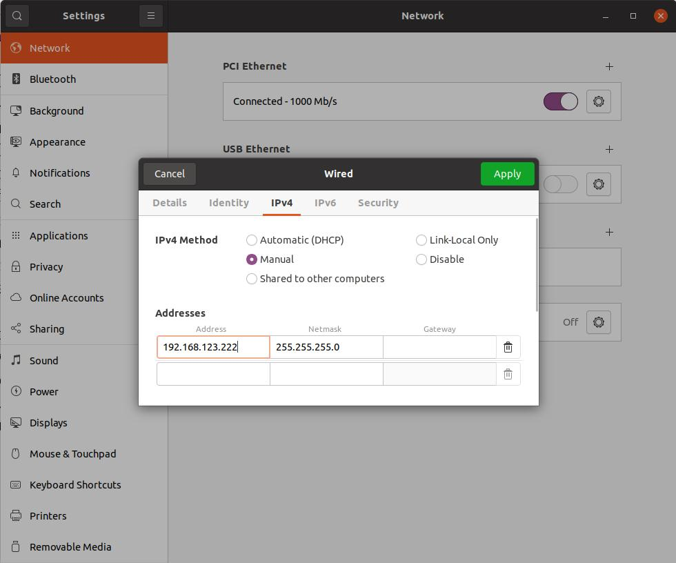
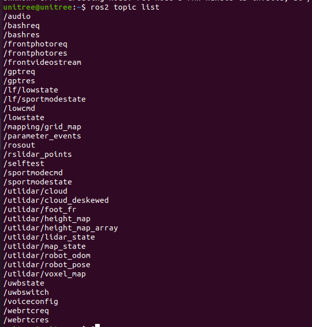

# Nav. baselines on Unitree GO2
## Prepare
### 1. Communication with GO2
Connect Unitree robot and the computer using Ethernet cable. Then, use ifconfig to view the network interface that the robot connected. For example, "enp118s0" in the following figure.

Then you can test the network by
```bash
ping 192.168.123.161
```
### 2. Install Docker
Install Docker under the guidance of [unitree-go2-docker](https://github.com/pengzhenghao/unitree-go2-docker)
### 3. ROS2 Docker
If you only need the basic topics (except the custom topics of unitree). You just pull the origial ros2 humle docker:
```bash
docker pull osrf/ros:humble-desktop
```
or pull the [unitree-go2-docker](https://github.com/pengzhenghao/unitree-go2-docker) to use the custom topics

Create a contrainer
**We mounted the home directory so you can directly use the host's conda and code.**
```bash
docker run -it  --name unitree_ros2 \
--env ROBOT_IP="192.168.123.161" \
--env CONN_TYPE="cyclonedds" \
--env WEBRTC_SERVER_HOST=0.0.0.0 \
--env WEBRTC_SERVER_PORT=${WEBRTC_SERVER_PORT:-9991} \
--env DISPLAY=${DISPLAY:-} \
--volume /tmp/.X11-unix:/tmp/.X11-unix \
--volume ${HOME}/.Xauthority:/root/.Xauthority:rw \
--volume ${HOME}:${HOME} \
--network host \
--privileged \
--device /dev/input:/dev/input \
osrf/ros:humble-desktop \
/bin/bash
```

Now you can view the topic list
```bash
ros2 topic list
```



## Baseline Union
### Download the repo.
```bash
# docker exec -it [CONTAINER_ID] /bin/bash
git clone https://github.com/HR-zju/nav_baseline_union.git
```

### Unitree python sdk2

_Developing with the Python SDK is currently considered the easiest approach_.
You can find the initial repo [here](https://github.com/unitreerobotics/unitree_sdk2_python).

1. You can check [here](./unitree_sdk2_python/README.md) for Python environment setup instructions.
    ```bash
    # simple
    pip install unitree_sdk2py
    export PYTHONPATH=[path]/unitree_sdk2_python:$PYTHONPATH # important
    ```

2. You can find some SDK usage examples in  `./unitree_sdk2_python/example/go2`. For instance, you can use the following command to achieve high-level control of the robotic dog:
    ```bash
    python example/go2/high_level/go2_sport_client.py enp118s0
    ```

3. Here is an example of using SDK2 to develop a script. This script publishes the front-camera `/camera/image` and subscribes to a control signal topic `/go2_high_level` to achieve velocity control of the Go2 robot:
    ```bash
    bash ./run_rosnode.sh
    ```
    Now you can visialize the front camera by rviz2 and control the robot by ros2. For example:
    ```bash
    ros2 topic pub /go2_high_level geometry_msgs/msg/Twist "{linear: {x: 0.1, y: 0.0, z: 0.0}, angular: {x: 0.0, y: 0.0, z: 0.0}}" --once
    ```
    How to kill the tmux session.
    ```
    tmux kill-session -t unitree_ros
    ```


### GNM, VinT and NoMaD
<font color="red">**Warning**: !!! python version must be 3.10.12 !!!</font>

1. You can check [here](./visualnav_ros/README.md) for Python environment setup instructions. 

2. Create Topomaps.
    ```bash
    cd visualnav_ros/deployment/src
    python create_topomap_ros2.py
    ```
    Then use the gamepad controller to guide the robotic dog through the desired path, enabling it to record and later autonomously repeat the route. The images will saved in `/deployment/topomaps/images/topomap`

3. Start navigation
    ```bash
    python navigate_ros2.py --model "[nomad/vint/gnm]" -—dir ../topomaps/images
    ```

4. Start PD controller
    ```bash
    python pd_controller_ros2.py # make sure run_rosnode.sh is running
    ```


### City walker
<font color="red">**Warning**: !!! python version must be 3.10.12 !!!</font>
1. You can check [here](./CityWalker/README.md) for Python environment setup instructions.

2. Start navigation
    ```bash
    cd ./Citywalker
    python test_ros2.py --config config/finetune.yaml --checkpoint ckpt/finetune.ckpt
    ```

3. Start PD controller
    ```bash
    cd visualnav_ros/deployment/src
    python pd_controller_ros2.py # make sure run_rosnode.sh is running
    ```

## Reference
https://support.unitree.com/home/en/developer/ROS2_service
https://github.com/unitreerobotics/unitree_sdk2_python
https://github.com/pengzhenghao/unitree-go2-docker

